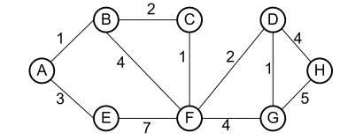

### problem 1
For the following questions, use the graph below and assume that we break ties by
visiting lexicographically earlier nodes first.  

(a) Give the depth first search preorder traversal starting from vertex A.  
dfs preorder: A -> B -> C -> F -> D -> G -> H -> E 

(b) Give the depth first search postorder traversal starting from vertex A.  
dfs postorder: H -> G -> D -> E -> F -> C -> B -> A 

(c) Give the breadth first search traversal starting from vertex A.  
bfs: A -> B -> E -> C -> F -> D -> G -> H 

(d) Give the order in which Dijkstra’s Algorithm would visit each vertex, starting  
from vertex A. Sketch the resulting shortest paths tree.  

