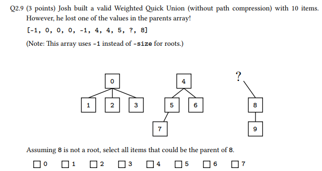

For Q2.1 and Q2.2, choose whether the following arrays represent a max heap, min heap, or neither:  
Q2.1 (1 point) [-, 1, 7, 2, 8, 15, 5, 3, 17, 9]
-> min-heap  
Q2.2 (1 point) [-, 59, 38, 47, 26, 46, 45, 13]
-> neither (38 < 46)
Q2.3 (2 points) From a pool of 𝑛 > 75 unique integers, Aditya wants to find the 75th-smallest element.
Which data structure would be best for this task?
-> max-heap

Q2.4 (1 point) True or False: If hashCode() is a valid hash function, then hashCode() + c is also a
valid hash function, where c is a fixed integer in [−1000000, 1000000].  
-> True  

Q2.5 (1 point) True or False: If hashCode() is a valid hash function, then hashCode() * c is also a
valid hash function, where c is a fixed integer in [−1000000, 1000000].  
-> True

Q2.6 (2 points) True or False: Finding a value is asymptotically faster in a 2-3 tree than in an LLRB,
because a 2-3 tree has a shorter height.  
-> False  

Q2.7 (2 points) Suppose we have a valid LLRB, and we add an element which creates a right-leaning
red link. With no other information, select all possible operations that could be the first balancing
operation after the insertion.

-> rotateLeft(), colorFlip()  

Q2.9 (3 points) Josh built a valid Weighted Quick Union (without path compression) with 10 items.
However, he lost one of the values in the parents array!  
[-1, 0, 0, 0, -1, 4, 4, 5, ?, 8]  
(Note: This array uses -1 instead of -size for roots.)  
Assuming 8 is not a root, select all items that could be the parent of 8.

-> 0, 4

Q2.10 (3 points) We are building a Weighted Quick Union (without path compression), and the object
initially has zero connections.  
What is the minimum number of union operations needed to create a tree of height 3?  
Recall that a tree’s height is the number of links from root to bottommost leaf. For example, a freshly
initialized WQU object has a height of 0, not 1.  

-> 7
