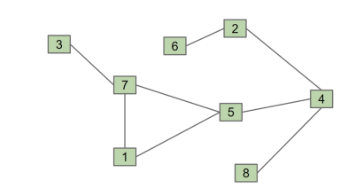

d) (75 points) Suppose we want a DFS pre-order of 12345678, i.e. in numerical order. In the original
graph, there is no vertex that could possibly yield this order if we perform a pre-order traversal.
What is the minimum number of edges we'd need to add to the graph so that a pre-order traversal could
yield this order from some start vertex?

Answer:  2 - 3, 1 - 2, 5 - 6, 3 - 4
4 edges 