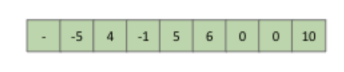

### Heaps and Tree Traversals (120 Points).
Suppose we have an ArrayHeap<Integer> that uses the array representation from class and discussion
(also called "tree representation 3B" in lecture). Recall that in this representation that the leftmost item is
unused. Consider a heap with the following underlying array:

a) (35 points) Suppose we perform a pre-order traversal of the heap represented by this array. What will
be the last value in the pre-order traversal?

